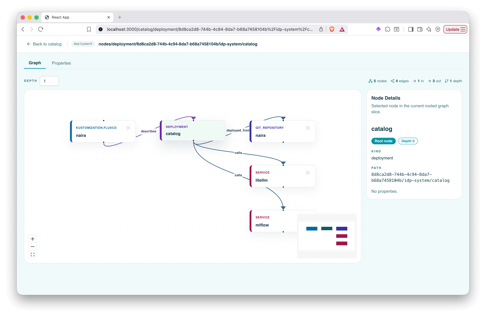
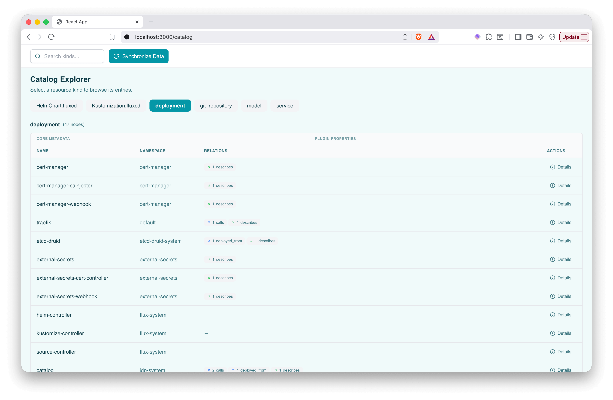
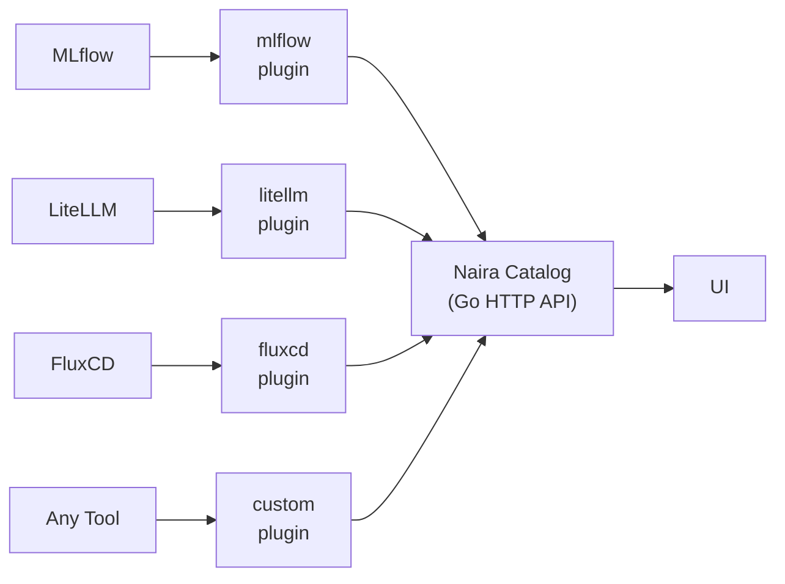

> [!WARNING]
> This Repository is under development and not ready for productive use. It is in an alpha stage. That means APIs and concepts may change on short notice including breaking changes or complete removal of apis.

<p align="center">
  
  
  
</p>

## About this project

**Naira** is an open-source **AI Engineering Development Hub** for cloud-native teams building and operating AI-enabled products on Kubernetes.

AI engineering today is fragmented: models, inferencing, gateways, observability, policies, and application delivery are spread across many tools, teams, and workflows. Naira brings these worlds together into one coherent platform experience.

Naira helps teams:

- **Discover and manage AI assets** across models, datasets, inference endpoints, and integrations  
- **Orchestrate AI platform workflows** using an opinionated, extensible architecture  
- **Improve reliability and governance** with unified visibility, policy integration, and auditability  
- **Accelerate delivery** through reusable templates, golden paths, and ecosystem plugins  
- **Avoid lock-in** by integrating existing best-of-breed tools instead of replacing them  

Built with and for the cloud-native ecosystem, Naira is designed to integrate closely with technologies such as **PlatformMesh**, **OpenMFP/Luigi**, **KCP**, and other components of the NeoNephos stack.

## Preview

<p align="center">
  
  <br/>
  <em>Catalog graph — browse assets and their relationships</em>
</p>

<p align="center">
  
  <br/>
  <em>Catalog explorer — browse all kind of assets</em>
</p>

## Getting Started

### Prerequisites

This project requires several local tools: (for example `kind`, `task`,`go`).

**The Recommended Way (Using mise):**
We use [mise](https://mise.jdx.dev/) to manage tools automatically. If you have `mise` installed and activated (`eval "$(mise activate zsh)"` - [more info](https://mise.jdx.dev/getting-started.html#activate-mise)), simply run:
```bash
mise install
```
**Alternative Way (Manual Installation):**
If you prefer not to use mise, you can find the exact versions of all tools in the [`mise.toml`](mise.toml) file.

### Local Development

To spin up the full environment on your machine:

1. **Deploy the platform** to a local kind cluster:
   ```bash
   task platform:deploy
   ```
   This creates a cluster, builds container images, loads them into kind, and applies all Kubernetes manifests.

2. **Port-forward services** to your localhost:
   ```bash
   task forward:all
   ```
   Once executed, the terminal will display the specific local endpoints for the UI, APIs, and various backend integrations.

3. **Open the UI** — once port-forwarding is running, go to:
   ```
   http://localhost:3001
   ```
   You should see the Naira dashboard.

### Repository Structure

```
├── catalog/              # Go catalog service (HTTP API, plugin manager)
├── plugins/              # Collector plugins (mlflow, litellm, fluxcd, ...)
├── ui-poc/               # React/TypeScript UI
├── naira-openmfp-portal/ # OpenMFP Portal (This is the backbone for future UI plugins)
├── deploy/               # Helm charts + dev environment (kind, k8s manifests)
├── docs/                 # Documentation
└── Taskfile.yml          # Root developer entrypoints
```

## Architecture

Naira uses a plugin-based collector model. Plugins run in your Kubernetes cluster, pull data from external systems (MLflow, LiteLLM, FluxCD, etc.), and push it to the catalog service. The UI then consumes the catalog API to visualize your platform landscape. For more details, take a look at the [docs](docs) and the [architecture repo](https://github.com/naira-project/architecture)



## Support, Feedback, Contributing

This project is open to feature requests/suggestions, bug reports etc. via [GitHub issues](https://github.com/naira-project/naira/issues). Contribution and feedback are encouraged and always welcome. For more information about how to contribute, the project structure, as well as additional contribution information, see our [Contribution Guidelines](CONTRIBUTING.md).

## Security / Disclosure
If you find any bug that may be a security problem, please follow our instructions at [in our security policy](https://github.com/naira-project/naira/security/policy) on how to report it. Please do not create GitHub issues for security-related doubts or problems.

## Code of Conduct

Please refer to our [Code of Conduct](https://github.com/naira-project/.github/blob/main/CODE_OF_CONDUCT.md) for information on the expected conduct for contributing to Platform Mesh.

<p align="center"></p>